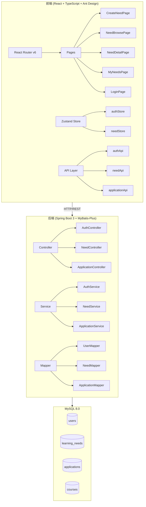
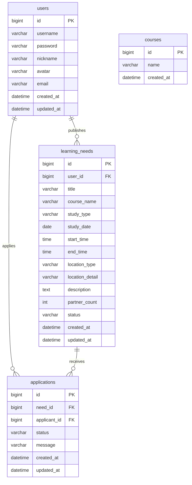

# 大学学习需求系统 - 项目设计文档

## 1. 系统架构



## 2. ER 图



## 3. 接口清单

### AuthController (`/api/auth`)
| Method | Path | Description |
|--------|------|-------------|
| POST | /register | 用户注册 |
| POST | /login | 用户登录 |
| GET | /me | 获取当前用户信息 |

### NeedController (`/api/needs`)
| Method | Path | Description |
|--------|------|-------------|
| POST | / | 发布学习需求 |
| GET | / | 分页浏览需求列表 |
| GET | /:id | 获取需求详情 |
| PUT | /:id | 编辑需求 |
| DELETE | /:id | 删除需求 |
| GET | /my | 获取我的需求列表 |
| PUT | /:id/status | 更新需求状态 |
| GET | /courses | 搜索课程列表 |

### ApplicationController (`/api/applications`)
| Method | Path | Description |
|--------|------|-------------|
| POST | / | 申请加入需求 |
| GET | /need/:needId | 获取需求的申请列表 |
| PUT | /:id/status | 审批申请 |

## 4. UI/UX 规范

### 设计理念
借鉴 Linear、Notion、Figma、Coursera 等顶级平台的设计语言，打造现代、简洁、高效的用户体验。

### 色彩系统

| 类别 | 色值 | 用途 |
|------|------|------|
| Primary | #8b5cf6 (Violet) | 主要操作、品牌色 |
| Accent | #06b6d4 (Cyan) | 辅助强调、图标 |
| Success | #22c55e | 成功状态 |
| Warning | #f59e0b | 警告状态 |
| Error | #ef4444 | 错误状态 |
| Gray-50 | #fafafa | 页面背景 |
| Gray-100 | #f4f4f5 | 卡片内背景 |
| Gray-800 | #27272a | 主要文字 |
| Gray-500 | #71717a | 次要文字 |

### 渐变色
```css
--gradient-primary: linear-gradient(135deg, #8b5cf6 0%, #06b6d4 100%);
--gradient-hero: linear-gradient(135deg, #667eea 0%, #764ba2 50%, #f093fb 100%);
```

### 阴影系统 (借鉴 Linear)
```css
--shadow-sm: 0 2px 4px rgba(0, 0, 0, 0.04), 0 1px 2px rgba(0, 0, 0, 0.06);
--shadow-md: 0 4px 8px rgba(0, 0, 0, 0.04), 0 2px 4px rgba(0, 0, 0, 0.06);
--shadow-lg: 0 8px 16px rgba(0, 0, 0, 0.06), 0 4px 8px rgba(0, 0, 0, 0.04);
--shadow-card-hover: 0 12px 24px rgba(0, 0, 0, 0.08), 0 0 0 1px rgba(139, 92, 246, 0.1);
```

### 圆角系统
| 尺寸 | 值 | 用途 |
|------|-----|------|
| sm | 6px | 小型元素、标签 |
| md | 10px | 按钮、输入框 |
| lg | 14px | 卡片 |
| xl | 20px | 大型卡片、弹窗 |
| full | 9999px | 圆形头像、胶囊按钮 |

### 字体系统
```css
font-family: 'Inter', -apple-system, BlinkMacSystemFont, 'Segoe UI', 'PingFang SC', sans-serif;
```

| 级别 | 字号 | 字重 | 用途 |
|------|------|------|------|
| Display | 1.875rem (30px) | 700 | 页面标题 |
| Title | 1.25rem (20px) | 600 | 区块标题 |
| Body | 1rem (16px) | 400 | 正文 |
| Small | 0.875rem (14px) | 400 | 辅助文字 |
| Caption | 0.75rem (12px) | 500 | 标签、时间戳 |

### 间距系统 (8px 基数)
```
4px / 8px / 12px / 16px / 20px / 24px / 32px / 40px / 48px / 64px
```

### 动画系统
```css
--transition-fast: 150ms cubic-bezier(0.4, 0, 0.2, 1);
--transition-base: 200ms cubic-bezier(0.4, 0, 0.2, 1);
--transition-slow: 300ms cubic-bezier(0.4, 0, 0.2, 1);
```

### 组件规范

#### 卡片 (Card)
- 基础卡片: 白色背景 + 1px 边框 + 14px 圆角
- 悬浮卡片: 白色背景 + 阴影 + 无边框
- 交互卡片: hover 时边框变紫色 + 上移 2px + 增强阴影

#### 按钮 (Button)
- Primary: 渐变背景 + 紫色阴影
- Default: 灰色边框 + hover 变紫色
- 圆角: 10px
- 高度: 默认 36px / Large 48px

#### 输入框 (Input)
- 圆角: 10px
- 边框: 灰色 → hover 紫色 → focus 紫色 + 光晕
- 高度: 默认 40px / Large 48px

#### 标签 (Tag)
- 圆角: 6px
- 无边框，使用背景色区分
- 字重: 500
